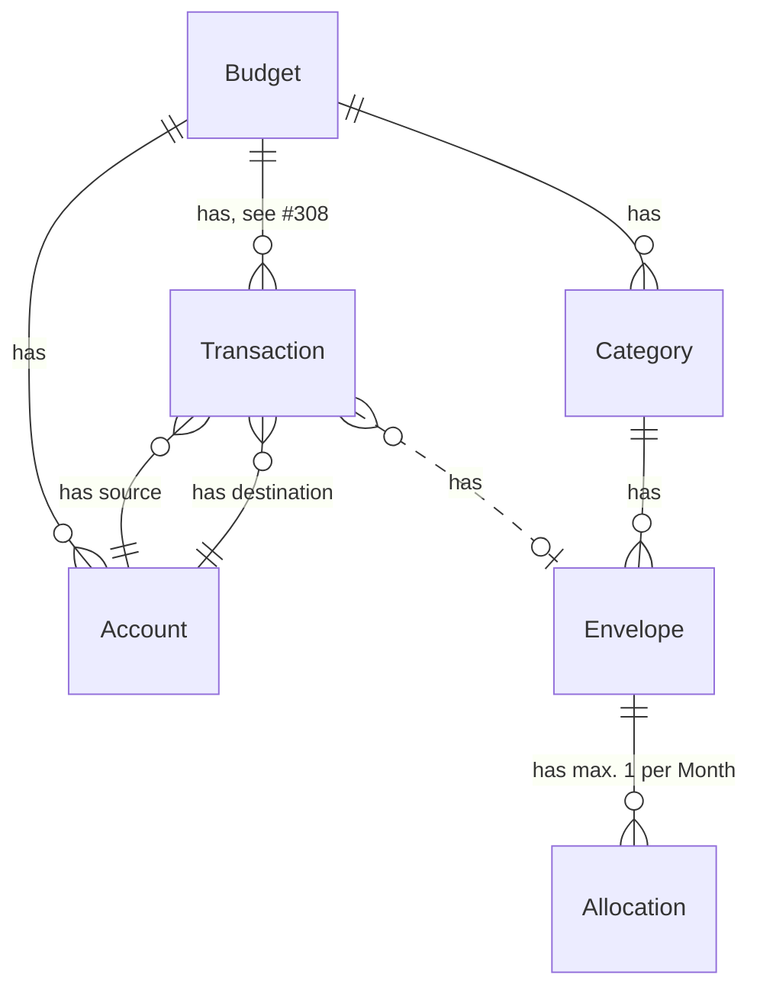

# Database schema

This document aims at developers who need to understand how the database schema looks. If you are looking for usage hints, go to [the usage guide](usage.md).

## Entity Relationship diagram

<!-- Use https://mermaid.live for easier editing of this diagram -->

